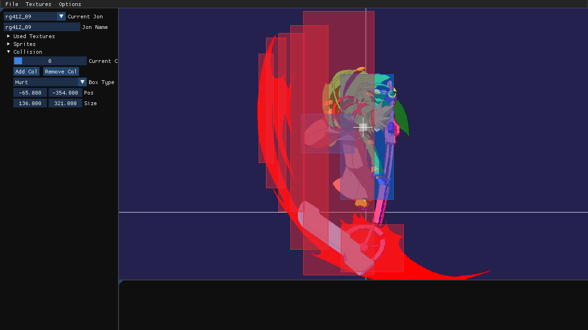

# JonTool
tool for jonbins

the arcsys collision format

### Usage
load a texture and a jonbin and boom

doesnt support models so if youre using a gg jonbin or smthn render it onto a texture first (usually 1280 x 1000 if you want it to show properly)

also use [geos tool](https://github.com/Geordan9/GeoArcSysAIOCLITool) itll help

### FAQ
"Why wont it show up???" make sure you export sprites ith canvas for now

"It's using a lot of memory" theyre big sprites and i havent added texture compression yet

"What do those buttons in options mean?" theyre pretty self explanitory but to help:

team red (3d model guys) handle anim frames in the collision files differently than team blue (sprite guys) so select that if exporting to a team red game

extended boxes are stuff that were added layer on (specifically the faust afro positioning), games before strive dont support it and will crash if you try to load it

granblue is dumb and adds padding inbetween hitboxes and will crash other games. granblue will also crash if the padding isnt there for them

# DONATING

dont im just a bum